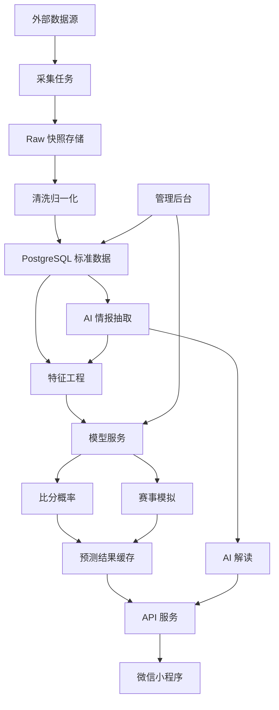
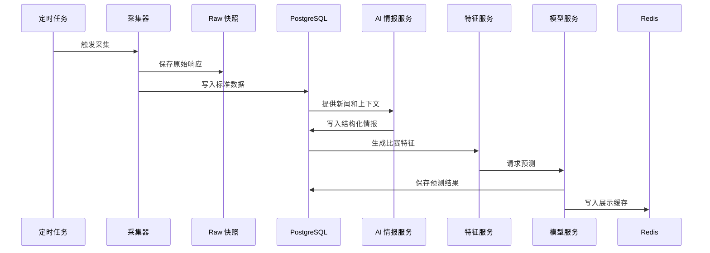
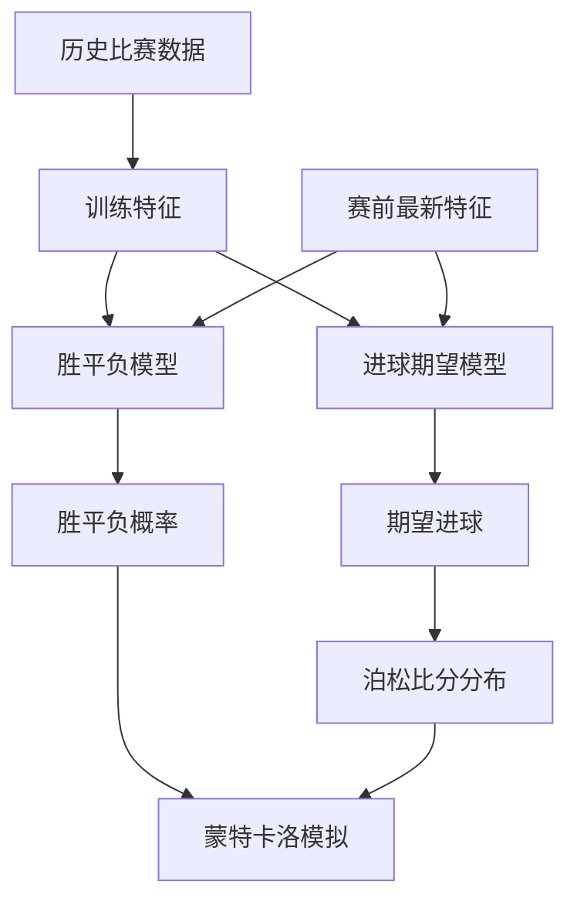
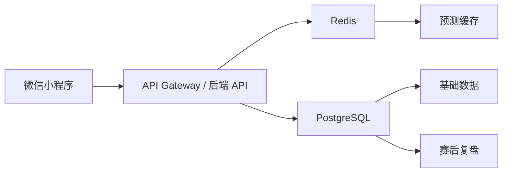

# 世界杯预测小程序架构设计

版本：v0.2
更新时间：2026-06-16

## 1. 架构目标

系统目标是支持低频数据更新、赛前预测、AI 情报抽取和小程序展示。

设计原则：

- 不做秒级实时比分。
- 小程序只访问后端 API，不直接访问外部数据源。
- 所有外部数据先入库和快照，再进入特征工程。
- LLM 只负责新闻理解、结构化抽取和解释生成，不直接决定胜负概率。
- 预测模型使用可回测、可校准的小模型。

## 2. 总体架构



## 3. 数据源

### 3.1 主数据源

生产建议接授权数据源：

```text
Sportmonks
API-Football
```

主要用于：

```text
赛程
比分
阵容
伤停
球员赛季统计
比赛技术统计
```

### 3.2 补充数据源

懂球帝适合作为中文数据补充和原型数据源。

已确认：

```text
世界杯 cid = 61
世界杯 season_id = 26123
```

可用接口形态：

```text
赛程：
/sport-data/soccer/biz/data/schedule?season_id=26123&app=dqd&version=853&platform=ios&language=zh-cn&round_all=1

积分榜：
/sport-data/soccer/biz/data/standing?season_id=26123&app=dqd&version=850&platform=ios&language=zh-cn

球员榜：
/sport-data/soccer/biz/data/person_ranking?season_id=26123&app=dqd&type=goals&language=zh-cn

阵容：
/sport-data/soccer/biz/dqd/bkb_match/lineup/{match_id}?app=dqd&lang=zh-cn
```

当前 MVP 内部验证阶段使用懂球帝作为世界杯 48 队球员、球员身价、球队榜指标、教练、赛程、积分榜和当前赛事球员状态的同一套身份源。这样可以先保证球队和球员能稳定匹配。正式公开上线或商业化前，必须保留适配器边界，切换到授权 API 作为主数据源，懂球帝只做中文展示补充和交叉校验。

### 3.3 历史训练数据

```text
Fjelstul World Cup Database
Kaggle International Football Results
StatsBomb Open Data
FIFA Ranking
World Football Elo Ratings
```

### 3.4 新闻和环境数据

```text
懂球帝资讯
FIFA 新闻
球队官方公告
NewsAPI / GDELT
Open-Meteo
FIFA 场馆信息
```

## 4. 数据更新流程



更新频率：

```text
每天凌晨：
  赛程、积分榜、球员榜、球队榜、新闻

每天 12:00：
  天气、新闻、伤停复查

比赛前 24 小时：
  伤停、预计首发、AI 情报

比赛前 3 小时：
  关键情报、最终赛前预测

比赛前 90 分钟：
  按 FIFA start list 时间窗口刷新最终首发，若拿不到最终首发则沿用赛前 3 小时版本并标记低置信度

比赛后：
  赛果、积分榜、球员数据、模型复盘
```

## 5. 后端模块

### 5.1 collector-service

职责：

```text
拉取外部数据
保存原始 JSON / HTML 快照
记录采集成功或失败
控制频率和重试
```

### 5.2 normalizer-service

职责：

```text
统一球队 ID
统一球员 ID
清洗中文名和英文名
处理时间格式
标准化比赛状态
```

### 5.3 ai-insight-service

职责：

```text
读取新闻
抽取伤停、停赛、战术、教练言论
输出结构化 impact_score
生成预测解释
检查数据冲突
```

### 5.4 feature-service

职责：

```text
生成单场比赛特征
聚合球队近期状态
聚合球员近期状态
计算阵容稳定性
计算环境影响
```

### 5.5 model-service

职责：

```text
训练胜平负模型
训练进球期望模型
生成单场预测
输出比分概率
进行概率校准
记录模型版本
```

### 5.6 simulation-service

职责：

```text
读取单场预测概率
模拟小组赛和淘汰赛
输出出线、晋级、冠军概率
```

### 5.7 api-service

职责：

```text
给小程序提供接口
读取 Redis 缓存
返回比赛、球队、球员、预测和模拟结果
```

## 6. 数据库核心表

```text
teams
players
matches
venues
coaches
raw_snapshots
team_stat_snapshots
team_form_snapshots
player_form_snapshots
news_items
ai_insights
model_features
model_versions
prediction_snapshots
match_predictions
scoreline_predictions
group_simulations
ranking_predictions
prediction_reviews
```

关键表说明：

```text
raw_snapshots：
  保存外部接口原始数据，方便追溯。

model_features：
  保存每次预测时输入模型的特征快照。

match_predictions：
  保存每场比赛不同时间点的预测结果。

model_versions：
  保存模型版本、训练数据范围、评估指标。

group_simulations：
  保存小组出线模拟结果。

ranking_predictions：
  保存冠军、四强、黑马等榜单概率。
```

## 7. 模型架构



当前 P0 模型清单：

```text
胜平负模型：
  history_core：基于历史国家队比赛的 multinomial logistic regression
  context_calibrator：用当前赛前上下文校准 history_core 的基础概率

进球期望模型：
  Poisson / Dixon-Coles / LightGBM Regressor

赛事模拟：
  Monte Carlo Simulation
```

P0 不直接上 LightGBM / CatBoost 作为主模型。原因是当前上下文特征大多是“当前快照”，严格训练要求每场历史比赛的赛前快照，否则会出现时间泄漏。当前路线先用两层小模型跑通：

```text
历史比赛 -> history_core -> base_probabilities
当前球队/球员/教练/伤停/球队榜上下文 -> context_calibrator
输出 calibrated probabilities
```

P1 再在补齐历史赛前快照后引入 LightGBM / CatBoost，与两层 Logistic 做回测对比。

推理输出必须带模型模式字段：

```text
inference_mode:
  context_calibrated        两队都有当前上下文，使用校准模型
  history_core_fallback     缺少一队上下文，回退历史核心模型
  history_core              仅历史模型运行

calibration_applied:
  true / false

fallback_reason:
  missing_context_features / null

base_probabilities:
  history_core 输出的基础胜平负概率
```

评估指标：

```text
Log Loss
Brier Score
Calibration Error
Top-1 Accuracy
比分 Top 5 覆盖率
```

2026 小组模拟必须按 FIFA 规则实现并回测。小组同分时先看同分球队之间的相互战绩，再看全组净胜球、全组进球、公平竞赛分，最后按最近及连续上一版 FIFA 男足世界排名兜底；32 强第三名晋级和对阵也必须单独测试，不能沿用 32 队世界杯旧规则。

## 8. 小程序访问架构



小程序不直接访问：

```text
懂球帝
FIFA
商业体育 API
新闻 API
OpenAI API
模型服务内部接口
```

## 9. 推荐技术栈

```text
小程序：
  微信原生 / Taro

后端：
  FastAPI

模型：
  Python
  scikit-learn / pure Python baseline
  LightGBM
  CatBoost

数据库：
  PostgreSQL

缓存：
  Redis

任务调度：
  APScheduler / Celery

AI：
  OpenAI API

部署：
  腾讯云 / 阿里云
  对象存储保存 Raw 快照
```

## 10. MVP 架构落地顺序

第一步：

```text
FastAPI 后端
PostgreSQL
懂球帝赛程、积分榜、球员榜采集
基础 API
```

第二步：

```text
历史比赛导入
Elo 计算
history_core + context_calibrator 小模型
Poisson 比分模型
```

第三步：

```text
AI 新闻抽取
AI 解读生成
match_predictions 入库
```

第四步：

```text
小程序首页
比赛详情页
小组页
预测榜
```

第五步：

```text
管理后台
人工审核
模型复盘
商业数据源替换
```
