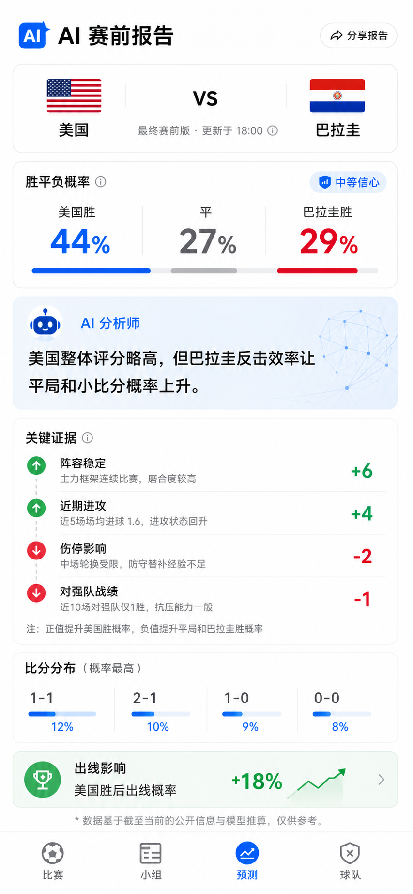
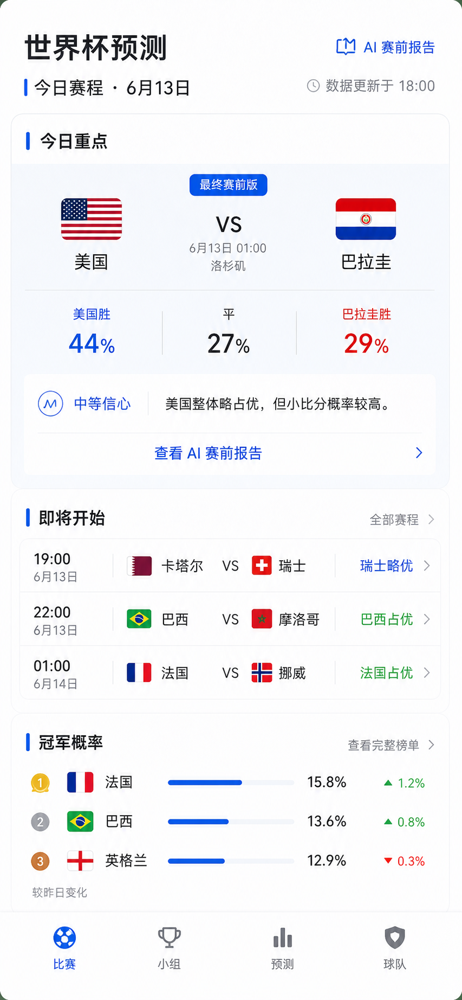
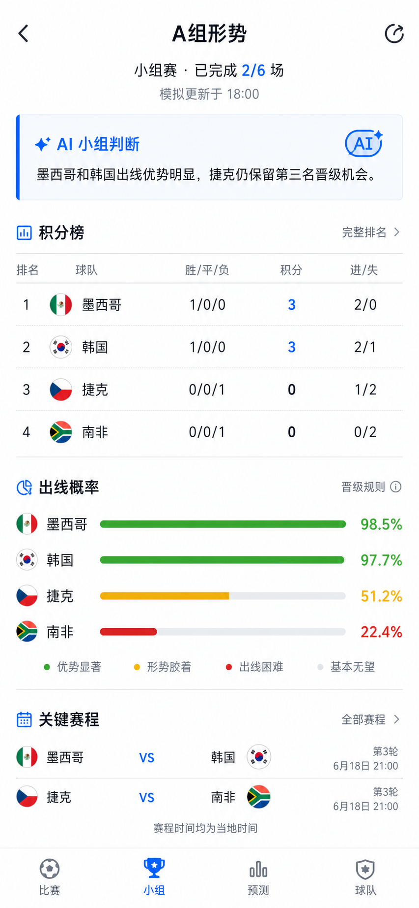
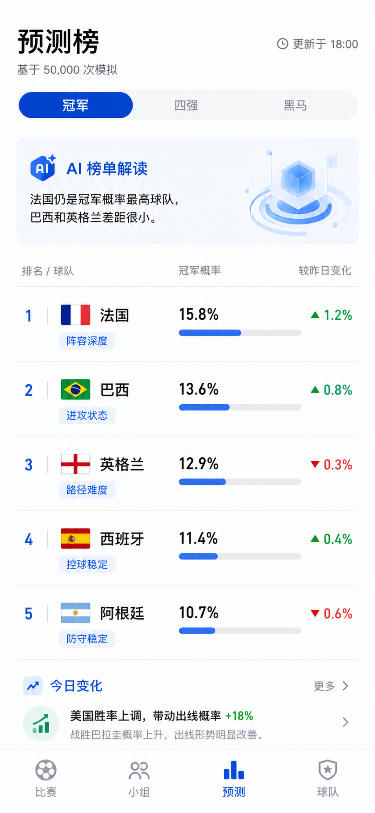
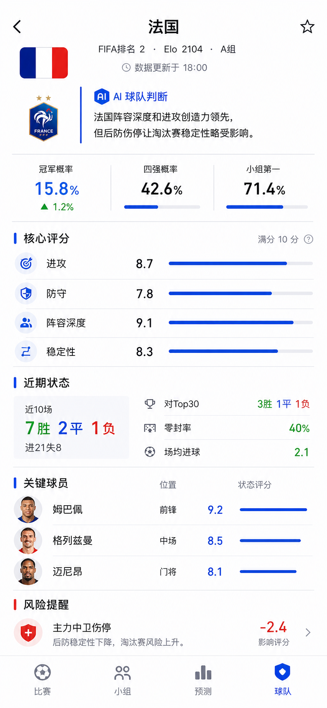

# 世界杯预测小程序设计方向

版本：v0.1  
更新时间：2026-06-13  
选定方向：AI 赛前报告型

## 1. 设计定位

小程序的核心体验不是“比分直播”，而是“赛前 AI 分析报告”。用户打开比赛详情页时，应立刻看到：

- 哪队更占优
- 概率是多少
- 信心等级如何
- 关键证据是什么
- 这场比赛对出线有什么影响

产品气质：

```text
可信
克制
专业
可解释
不博彩化
不做营销感
```

## 2. 视觉参考

选定视觉方向如下：

### 2.1 比赛详情页：AI 赛前报告



该方向的核心是把比赛详情页设计成一份紧凑的 AI 分析报告，而不是普通体育资讯页。

### 2.2 首页：AI 简报



首页承担“今天看什么”的任务，重点是今日比赛、最重要的一场预测、AI 报告入口和冠军概率摘要。

### 2.3 小组页：出线形势



小组页承担“现在谁更稳”的任务，重点是积分榜、出线概率和剩余关键赛程。

### 2.4 预测榜：赛事级概率



预测榜承担“谁最可能走远”的任务，重点是冠军概率、四强概率、黑马指数和概率变化原因。

### 2.5 球队页：球队分析档案



球队页承担“为什么这支队强或弱”的任务，重点是球队判断、赛事概率、核心评分、近期状态、关键球员和风险提醒。

## 3. 设计原则

### 3.1 概率优先

每个核心页面都要优先展示概率结论：

```text
胜平负概率
比分概率
出线概率
冠军概率
```

文字解释服务于概率，不替代概率。

### 3.2 证据清晰

AI 解读必须有证据列表支撑：

```text
阵容稳定 +6
近期进攻 +4
伤停影响 -2
对强队战绩 -1
```

用户要能看懂“为什么模型这样判断”。

### 3.3 不使用博彩语言

避免：

```text
盘口
下注
赔率推荐
稳赚
命中
```

推荐使用：

```text
概率
预测
倾向
信心
影响因素
赛前判断
```

### 3.4 信息密度适中

面向普通球迷和深度球迷之间的用户：

- 首页轻量
- 比赛详情重点突出
- 证据和数据可展开
- 深度信息放到球队页和球员页

## 4. 视觉系统

### 4.1 色彩

基础色：

```text
背景：#F7F8FA
主文本：#111827
次文本：#6B7280
弱文本：#9CA3AF
分隔线：#E5E7EB
白色表面：#FFFFFF
```

功能色：

```text
AI 蓝：#2563EB
足球绿：#16A34A
负向红：#DC2626
提醒黄：#D97706
中性灰：#64748B
```

使用规则：

- 蓝色用于 AI 报告、信心、分析状态。
- 绿色用于正向影响、概率提升。
- 红色只用于负向影响和伤停。
- 黄色用于中等信心、注意项。
- 不使用大面积渐变。

### 4.2 字体层级

```text
页面标题：22-24px / 600
模块标题：16-18px / 600
核心数字：28-36px / 700
正文：14-15px / 400
辅助信息：12-13px / 400
```

移动端避免过大标题，保持数据可读。

### 4.3 布局

页面宽度以 390px 移动端为基准。

间距建议：

```text
页面左右边距：16px
模块上下间距：16-20px
列表行高：48-64px
小标签高度：24-28px
底部导航高度：56-64px
```

模块不做层层嵌套卡片。优先使用：

```text
留白
分组
分隔线
浅色区块
```

## 5. 页面设计

### 5.1 首页

目标：让用户快速找到今日重点比赛和 AI 报告。

主要模块：

```text
顶部：
  世界杯预测
  今日赛程
  数据更新时间

重点比赛：
  美国 vs 巴拉圭
  胜平负概率
  信心等级
  AI 报告入口

今日赛程：
  比赛时间
  球队
  预测倾向
  报告状态

冠军概率：
  Top 5 球队

底部导航：
  比赛 / 小组 / 预测 / 球队
```

首页卡片文案示例：

```text
最终赛前版
美国略占优
查看 AI 报告
```

#### 5.1.1 首页详细结构

顶部区域：

```text
世界杯预测
今日赛程 · 6月13日
数据更新于 18:00
```

今日重点模块：

```text
模块标题：今日重点
比赛：美国 vs 巴拉圭
状态：最终赛前版
概率：美国胜 44% · 平 27% · 巴拉圭胜 29%
信心：中等信心
AI 摘要：美国整体略占优，但小比分概率较高。
操作：查看 AI 赛前报告
```

即将开始模块：

```text
卡塔尔 vs 瑞士 · 19:00 · 瑞士略优
巴西 vs 摩洛哥 · 22:00 · 巴西占优
法国 vs 挪威 · 01:00 · 法国占优
```

冠军概率模块：

```text
法国 15.8%
巴西 13.6%
英格兰 12.9%
```

首页交互：

```text
点击今日重点 -> 比赛详情页
点击比赛行 -> 对应比赛详情页
点击冠军概率 -> 预测榜页
点击底部导航 -> 切换一级页面
```

首页状态：

```text
待生成：显示“预测生成中”
已生成：显示“最终赛前版”或“初版”
已结束：显示“赛后复盘”
数据异常：显示“数据待校验”
```

### 5.2 比赛详情页

这是产品最核心页面。

页面结构：

```text
比赛头部
概率摘要
AI 赛前报告
证据列表
比分分布
出线影响
双方对比
相关新闻
```

核心区域：

```text
AI 赛前报告
美国 vs 巴拉圭
最终赛前版 · 更新于 18:00

美国胜 44%
平 27%
巴拉圭胜 29%

中等信心
美国整体评分略高，但巴拉圭反击效率让平局和小比分概率上升。
```

证据列表：

```text
阵容稳定 +6
近期进攻 +4
伤停影响 -2
对强队战绩 -1
```

比分分布：

```text
1-1 12%
2-1 10%
1-0 9%
0-0 8%
```

出线影响：

```text
美国胜后出线概率 +18%
平局后出线概率 +6%
失利后出线概率 -21%
```

#### 5.2.1 比赛详情详细结构

页面头部：

```text
返回
AI 赛前报告
最终赛前版 · 更新于 18:00
```

比赛信息：

```text
美国 vs 巴拉圭
小组赛 · 6月13日 01:00
场馆：洛杉矶
```

概率摘要：

```text
美国胜 44%
平局 27%
巴拉圭胜 29%
信心：中等信心
```

AI 结论：

```text
美国整体评分略高，但巴拉圭反击效率让平局和小比分概率上升。
```

关键证据：

```text
阵容稳定 +6
近期进攻 +4
伤停影响 -2
对强队战绩 -1
```

比分分布：

```text
1-1 12%
2-1 10%
1-0 9%
0-0 8%
```

双方对比：

```text
近期状态：美国 7.2 / 巴拉圭 6.8
预计首发身价：美国略高
对 Top30 战绩：巴拉圭略优
伤停影响：美国 -2 / 巴拉圭 0
```

赛后状态：

```text
实际比分
赛前概率
模型偏差
判断正确因素
判断偏差因素
```

### 5.3 小组页

目标：展示积分榜和出线概率。

页面结构：

```text
小组切换
积分榜
出线概率
剩余关键比赛
AI 小组形势总结
```

球队行：

```text
1 美国 3分 出线 68%
2 巴拉圭 1分 出线 42%
```

AI 小组形势：

```text
本组第二名竞争接近，美国若击败巴拉圭，出线概率将明显提升。
```

#### 5.3.1 小组页详细结构

顶部区域：

```text
A组形势
小组赛 · 已完成 2/6 场
模拟更新于 18:00
```

小组切换：

```text
A组 B组 C组 D组 E组 F组 ...
```

AI 小组判断：

```text
墨西哥和韩国出线优势明显，捷克仍保留第三名晋级机会。
```

积分榜字段：

```text
排名
球队
胜平负
进/失
积分
```

积分榜示例：

```text
1 墨西哥 1胜0平0负 进2失0 3分
2 韩国 1胜0平0负 进2失1 3分
3 捷克 0胜0平1负 进1失2 0分
4 南非 0胜0平1负 进0失2 0分
```

出线概率：

```text
墨西哥 98.5%
韩国 97.7%
捷克 51.2%
南非 22.4%
```

关键赛程：

```text
墨西哥 vs 韩国
捷克 vs 南非
```

小组页交互：

```text
切换小组 -> 更新积分榜和模拟概率
点击球队 -> 球队页
点击比赛 -> 比赛详情页
点击概率条 -> 展开模拟说明
```

### 5.4 预测榜页

目标：展示赛事级概率。

模块：

```text
冠军概率
四强概率
黑马指数
概率变化
```

列表字段：

```text
球队
冠军概率
较昨日变化
主要原因
```

#### 5.4.1 预测榜详细结构

顶部区域：

```text
预测榜
基于 50,000 次模拟
更新于 18:00
```

分段切换：

```text
冠军
四强
黑马
```

AI 榜单解读：

```text
法国仍是冠军概率最高球队，巴西和英格兰差距很小。
```

冠军概率列表：

```text
1 法国 15.8% ▲1.2% · 阵容深度
2 巴西 13.6% ▲0.8% · 进攻状态
3 英格兰 12.9% ▼0.3% · 路径难度
4 西班牙 11.4% ▲0.4% · 防守稳定
5 阿根廷 10.7% ▼0.6% · 伤停影响
```

今日变化：

```text
美国胜率上调，带动出线概率 +18%
```

预测榜交互：

```text
切换冠军/四强/黑马 -> 刷新榜单
点击球队 -> 球队页
点击变化原因 -> 展开相关比赛和因素
点击今日变化 -> 进入相关比赛详情
```

榜单状态：

```text
初始版：小组赛前
赛中版：每天更新
赛后版：比赛结束后重算
```

### 5.5 球队页

目标：解释球队为什么强或弱。

模块：

```text
球队概览
近期状态
对强队表现
阵容稳定性
球员状态
主教练信息
预测关联比赛
```

#### 5.5.1 球队页详细结构

顶部区域：

```text
法国
FIFA排名 2 · Elo 2104 · A组
数据更新于 18:00
```

AI 球队判断：

```text
法国阵容深度和进攻创造力领先，但后防伤停让淘汰赛稳定性略受影响。
```

赛事概率模块：

```text
冠军概率 15.8% ▲1.2%
四强概率 42.6%
小组第一 71.4%
```

核心评分：

```text
进攻 8.7
防守 7.8
阵容深度 9.1
稳定性 8.3
```

近期状态：

```text
近10场 7胜2平1负 · 进21失8
对Top30 3胜1平1负
零封率 40%
场均进球 2.1
```

关键球员：

```text
姆巴佩 · 前锋 · 状态 9.2
格列兹曼 · 中场 · 状态 8.5
迈尼昂 · 门将 · 状态 8.1
```

风险提醒：

```text
主力中卫伤停 -2.4
连续客场旅途消耗 -0.8
淘汰赛路径偏难 -1.1
```

关联比赛：

```text
法国 vs 挪威
法国 vs 小组第二
```

#### 5.5.2 球队页交互

```text
点击冠军概率 -> 预测榜，对应球队高亮
点击核心评分 -> 展开评分解释
点击近期状态 -> 展开近 10 场比赛列表
点击关键球员 -> 球员页
点击风险提醒 -> 展开新闻来源和 AI 证据
点击关联比赛 -> 比赛详情页
```

#### 5.5.3 球队评分解释

评分统一用 0 到 10 分：

```text
进攻：
  近期进球、射门、关键传球、预计首发攻击线状态

防守：
  近期失球、零封率、门将状态、中卫伤停

阵容深度：
  替补身价、替补近期出场、主力缺阵后的替代能力

稳定性：
  首发重复率、常用阵型占比、主教练上任时长
```

#### 5.5.4 球队页状态

```text
赛前：
  展示赛事概率、状态和风险

比赛日：
  增加“今日比赛”入口

赛后：
  更新近期状态和概率变化

淘汰：
  显示“已出局”，保留赛后复盘
```

### 5.6 球员页

目标：展示球员状态和对预测的影响。

模块：

```text
球员基础信息
近期比赛
进球助攻
评分
伤停状态
对本场影响
```

## 6. 核心组件

### 6.1 ProbabilitySummary

用途：展示胜平负概率。

内容：

```text
主队胜率
平局概率
客队胜率
最高概率高亮
```

设计：

- 使用横向三段布局。
- 数字大于标签。
- 最高概率使用蓝色或绿色强调。
- 不使用博彩赔率样式。

### 6.2 AIReportCard

用途：展示 AI 解读。

内容：

```text
报告状态
信心等级
核心结论
更新时间
```

状态：

```text
待生成
初版
最终赛前版
赛后复盘
```

### 6.3 EvidenceList

用途：展示模型关键因素。

字段：

```text
因素名称
影响分
影响方向
简短说明
```

示例：

```text
阵容稳定 +6
近 5 场首发重复率更高
```

### 6.4 ScorelineDistribution

用途：展示比分概率。

形式：

- 横向条形图
- Top 4 或 Top 5
- 每行一个比分和概率

### 6.5 QualificationImpact

用途：展示本场比赛对出线概率的影响。

内容：

```text
胜 / 平 / 负 三种情况下的出线概率变化
```

### 6.6 BottomNav

导航：

```text
比赛
小组
预测
球队
```

## 7. 交互设计

### 7.1 首页到比赛详情

用户点击比赛卡片，进入比赛详情。

默认打开：

```text
AI 赛前报告
```

### 7.2 比赛详情展开

默认展示：

```text
概率摘要
AI 报告
证据列表前 4 项
比分 Top 4
```

可展开：

```text
完整双方对比
完整新闻情报
完整特征解释
```

### 7.3 赛前到赛后

比赛结束后，比赛详情切换为：

```text
赛后复盘
赛前预测
实际比分
预测偏差原因
```

### 7.4 数据更新时间

所有预测结果必须显示更新时间：

```text
更新于 18:00
最终赛前版
```

避免用户误以为是实时预测。

## 8. 文案规范

推荐文案：

```text
略占优
胜率更高
平局概率不低
中等信心
关键证据
出线影响
最终赛前版
模型预测
AI 赛前报告
```

避免文案：

```text
稳赚
必胜
下注
盘口
爆冷稳了
```

## 9. MVP 页面优先级

第一批设计：

```text
1. 首页
2. 比赛详情页
3. 小组页
4. 预测榜页
```

第二批设计：

```text
5. 球队页
6. 球员页
7. 赛后复盘页
8. 管理后台
```

## 10. 原型建议

建议先做一个移动端 H5 原型，尺寸按小程序适配：

```text
390 x 844
```

原型包含：

```text
首页 -> 比赛详情 -> 小组页 -> 预测榜
```

原型和上线版本均走后端真实 API；缺失数据展示空状态，不再使用静态占位数据。
