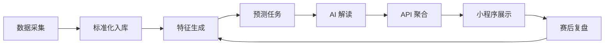
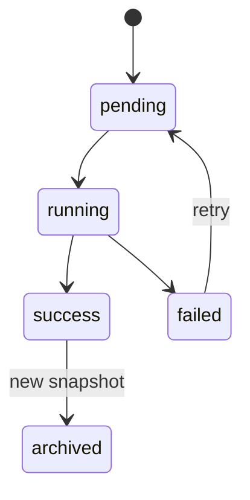

# 功能设计

版本：v0.1  
更新时间：2026-06-13  
用途：定义小程序、后端、数据任务、预测任务、AI 情报任务的功能边界和验收点。

## 1. MVP 功能闭环



第一版必须跑通：

```text
赛程入库 -> 球队/球员状态入库 -> 预测生成 -> AI 解读生成 -> 小程序展示
```

## 2. 前端功能

### 2.1 首页

目标：让用户快速看到今天最重要的预测结论。

必须展示：

- 今日重点比赛。
- 双方球队、时间、场馆、阶段。
- 胜平负概率。
- AI 倾向和置信度。
- 即将开始比赛列表。
- 冠军概率榜 Top 3。
- 数据更新时间。

接口：

```text
GET /api/v1/home
```

验收点：

- 无数据时显示空状态，不白屏。
- 没有预测时展示比赛信息，并提示“预测生成中”。
- 更新时间必须可见。

### 2.2 比赛详情页

目标：解释为什么模型这么预测。

必须展示：

- 比赛基础信息。
- 胜平负概率。
- 期望进球。
- Top 比分分布。
- 关键证据。
- AI 赛前报告。
- 小组出线影响。

接口：

```text
GET /api/v1/matches/{match_id}
GET /api/v1/matches/{match_id}/prediction
GET /api/v1/matches/{match_id}/ai-report
```

验收点：

- 概率和必须约等于 100%。
- Top 比分至少 3 个。
- AI 报告必须有证据来源或 fallback 说明。

### 2.3 小组页

目标：查看积分榜和出线形势。

必须展示：

- 小组列表。
- 积分榜。
- 出线概率。
- 小组关键比赛。
- AI 小组判断。

接口：

```text
GET /api/v1/groups
GET /api/v1/groups/{group_id}
GET /api/v1/groups/{group_id}/simulation
```

验收点：

- 积分榜排序正确。
- 出线概率在 0 到 100%。
- 模拟数据缺失时仍显示真实积分榜。

### 2.4 预测榜

目标：查看冠军、四强、黑马概率。

必须展示：

- 冠军榜。
- 四强榜。
- 黑马榜。
- 榜单变化。
- AI 榜单解读。

接口：

```text
GET /api/v1/predictions/rankings?type=champion
GET /api/v1/predictions/rankings?type=semifinal
GET /api/v1/predictions/rankings?type=darkhorse
```

验收点：

- tab 切换可用。
- 概率条和排序一致。
- delta 正负展示正确。

### 2.5 球队页

目标：解释一支球队的综合状态。

必须展示：

- 球队基础信息。
- 冠军/四强/小组第一概率。
- 进攻、防守、阵容深度、稳定性评分。
- 近期战绩。
- 关键球员状态。
- 风险提醒。

接口：

```text
GET /api/v1/teams/{team_id}/profile
```

验收点：

- 球队评分必须在 0 到 10。
- 关键球员为空时展示空状态。
- 风险为空时不报错。

## 3. 后端功能

### 3.1 API 聚合服务

职责：

- 查询数据库和 Redis。
- 聚合页面所需数据。
- 统一错误格式。
- 提供 OpenAPI 文档。

不做：

- 不直接抓第三方网页。
- 不实时跑模型。
- 不调用 OpenAI 生成内容。

验收点：

- `/health` 可访问。
- 所有小程序页面接口返回 200 或明确业务错误。
- 首页 P95 小于 500ms。
- 比赛详情 P95 小于 800ms。

### 3.2 缓存策略

缓存 key：

```text
home:{date}:{timezone}
match:{match_id}
match_prediction:{match_id}
match_ai_report:{match_id}
group:{group_id}
group_simulation:{group_id}
ranking:{type}
team_profile:{team_id}
```

刷新规则：

- 数据采集成功后清理相关基础数据缓存。
- 预测任务成功后清理预测缓存。
- AI 任务成功后清理 AI 报告缓存。
- API 读取 Redis 失败时降级查数据库。

## 4. 数据采集功能

### 4.1 数据源适配器

统一接口：

```text
fetch() -> raw_snapshot
parse(raw_snapshot) -> normalized_records
upsert(normalized_records) -> write_result
```

适配器类型：

| Adapter | MVP | 说明 |
| --- | --- | --- |
| ScheduleAdapter | P0 | 赛程 |
| StandingsAdapter | P0 | 积分榜 |
| TeamAdapter | P0 | 球队基础信息 |
| PlayerRankingAdapter | P1 | 进球、助攻、评分 |
| InjuryNewsAdapter | P1 | 伤停新闻 |
| MarketValueAdapter | P1 | 球员/球队身价 |

### 4.2 懂球帝原型策略

用途：

- 原型阶段补中文球队、球员、近期数据。
- 用 raw 快照保留来源。
- 和商业 API/公开数据交叉校验。

限制：

- 不作为正式商业化唯一数据源。
- 采集频率必须低。
- 如果页面结构变化，采集任务失败但不能影响 API 服务。

### 4.3 采集验收点

- 每次采集都有 `collector_runs` 记录。
- 每次外部响应都有 `raw_snapshots`。
- 重复执行不会插入重复比赛。
- 解析失败时记录错误。
- 关键 ID 匹配低置信度时进入人工校验。

## 5. 预测功能

### 5.1 MVP 模型

第一版使用可解释 baseline：

```text
Elo 差异
FIFA 排名差异
近期 10 场状态
进失球差异
球员身价差异
伤停影响
休息天数
场地/主场影响
```

胜平负：

```text
特征 -> baseline score -> softmax/probability calibration
```

比分分布：

```text
expected_goals_home
expected_goals_away
-> Poisson distribution
-> Top scorelines
```

小组/冠军：

```text
单场概率 -> Monte Carlo 50000 次 -> 出线/晋级/冠军概率
```

### 5.2 预测任务状态



### 5.3 预测验收点

- 胜平负概率和误差小于 0.001。
- 期望进球在 0 到 5 的合理范围。
- Top 比分不为空。
- 同一数据快照 + 同一随机种子结果可复现。
- 每次预测保存 `model_version_id`。
- 数据缺失时使用 fallback，不直接失败。

## 6. AI 情报功能

### 6.1 AI 抽取

输入：

- 新闻标题。
- 新闻摘要。
- 来源 URL。
- 相关球队和球员候选。

输出：

```json
{
  "event_type": "injury",
  "team": "法国",
  "player": "某球员",
  "impact_area": "defense",
  "impact_score": -2.4,
  "confidence": 0.84,
  "evidence": "新闻提到该球员因伤缺席首战",
  "source_url": "https://example.com/news"
}
```

入库规则：

- JSON schema 校验通过才入库。
- `confidence < 0.65` 不进入模型。
- 必须保留 `source_url`。
- 同一新闻重复不重复入库。

### 6.2 AI 解读

输入：

- `match_predictions`
- `scoreline_predictions`
- `model key_factors`
- `ai_insights`

输出：

- 页面展示用短结论。
- 证据列表。
- 置信度标签。

禁止：

- 不允许编造未入库新闻。
- 不允许说“必胜”。
- 不允许出现下注、盘口、赔率推荐。

### 6.3 fallback

OpenAI 调用失败时：

- 返回模型基础解释。
- 标记 `ai_status=fallback`。
- 页面仍可展示预测。

## 7. 赛后复盘功能

第一版可以后置，但数据结构要预留。

流程：

```text
比赛结束 -> 更新实际比分 -> 找到赛前预测 -> 计算命中与误差 -> 生成复盘摘要
```

展示：

- 赛前预测。
- 实际比分。
- 方向是否命中。
- 比分是否命中。
- 误差原因。

## 8. 后台/运维功能

MVP 不做复杂后台，先做命令和 admin API。

必须支持：

- 手动触发采集。
- 手动重跑预测。
- 手动重建 AI 解读。
- 查看最近任务状态。
- 查看数据冲突。

## 9. 端到端验收用例

### 9.1 首页闭环

步骤：

```text
导入真实赛程、积分榜、球员和历史比赛数据
运行预测任务
运行 AI 解读任务
调用 GET /api/v1/home
小程序首页展示
```

期望：

```text
有今日重点比赛
有胜平负概率
有 AI 摘要
有更新时间
```

### 9.2 比赛详情闭环

步骤：

```text
调用 GET /api/v1/matches/{match_id}
调用 GET /api/v1/matches/{match_id}/prediction
调用 GET /api/v1/matches/{match_id}/ai-report
```

期望：

```text
比赛基础信息完整
概率和为 1
Top 比分不为空
AI 报告有证据
```

### 9.3 数据采集闭环

步骤：

```text
运行 schedule collector
运行 standings collector
运行 player ranking collector
检查 raw_snapshots
检查标准表
```

期望：

```text
raw 快照存在
标准表有数据
collector_runs 成功
重复运行幂等
```

## 10. 开发顺序

建议接下来按这个顺序做：

1. 建 `services/api` FastAPI 骨架。
2. 建 PostgreSQL schema 和 Alembic 迁移。
3. 写真实数据采集和历史数据导入脚本。
4. 实现 public API。
5. 小程序 service 层接入真实 API。
6. 实现采集任务框架。
7. 实现 baseline 预测任务。
8. 实现 AI 情报和解读任务。

## 11. 当前不做

- 用户登录。
- 评论/社区。
- 付费。
- 实时比分直播。
- 复杂管理后台。
- 完整球员详情页。
- 盘口、赔率、下注相关功能。
