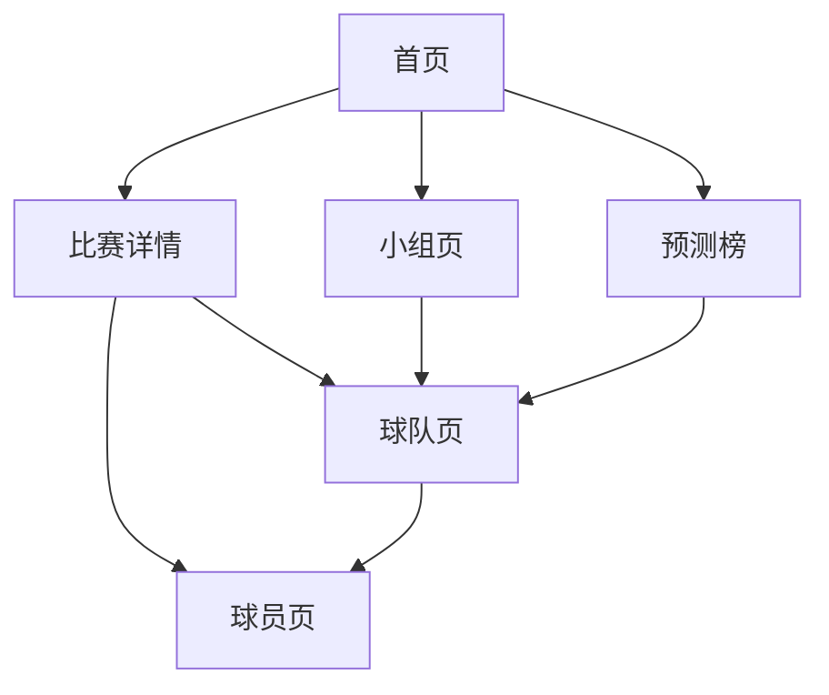

# 世界杯预测小程序 PRD

版本：v0.1  
状态：草案  
更新时间：2026-06-13  
产品定位：低频更新的世界杯赛前预测与 AI 解读小程序

## 1. 产品概述

### 1.1 产品一句话

一个面向球迷的世界杯预测小程序，基于球队、球员、历史战绩、新闻情报和场地环境数据，提供每场比赛的胜平负概率、比分概率、出线概率和 AI 赛前解读。

### 1.2 产品定位

本产品不是实时比分工具，而是赛前分析和预测工具。

核心特点：

- 数据低频更新，不做秒级实时抓取。
- 用小模型输出预测概率。
- 用 AI 阅读新闻、抽取伤停和战术情报。
- 用可解释方式展示预测原因。
- 支持比赛级预测和赛事级模拟。

### 1.3 用户价值

用户在看比赛前，可以快速了解：

- 哪支球队更被看好。
- 最可能出现的比分。
- 哪些球员、伤停、阵容和场地因素影响比赛。
- 当前比赛对小组出线和晋级概率有什么影响。
- 模型为什么这样预测。

## 2. 背景和机会

世界杯期间，用户对赛前判断、比分预测、出线形势和球队状态有强需求。现有内容多是资讯、专家观点或盘口解读，常见问题是：

- 信息分散，赛程、球员、伤停、新闻、历史数据需要到多个平台查。
- 预测缺少结构化依据。
- 很多分析是文字观点，不能稳定输出概率。
- 很少能把球员状态、主教练、阵容稳定性、场地因素一起纳入。
- 用户看不清预测背后的关键因素。

本产品用数据和 AI 结合：

- 数据负责客观状态。
- 模型负责概率计算。
- AI 负责情报理解和解释。

## 3. 产品目标

### 3.1 MVP 目标

第一版完成端到端闭环：

```text
数据采集 -> 特征生成 -> 模型预测 -> AI 解读 -> 小程序展示 -> 赛后复盘
```

MVP 必须支持：

- 世界杯比赛列表
- 单场胜平负概率
- 单场比分概率
- 关键影响因素
- AI 预测解读
- 小组积分榜
- 小组出线概率
- 赛后预测复盘

### 3.2 非目标

第一版不做：

- 秒级实时比分直播
- 视频直播
- 博彩交易或下注功能
- 用户付费专家方案
- 复杂社区讨论
- 训练大语言模型
- 只依赖 AI 直接判断胜负

## 4. 用户画像

### 4.1 普通球迷

特征：

- 世界杯期间集中看球。
- 不一定了解所有球队和球员。
- 想快速知道比赛看点和预测结果。

需求：

- 今天有哪些比赛。
- 哪场更值得看。
- 哪队更可能赢。
- 比赛关键人物是谁。

### 4.2 深度球迷

特征：

- 关注球队状态、阵容、主教练、战术。
- 喜欢看数据和概率。
- 会比较不同球队的出线形势。

需求：

- 球队近期状态。
- 对强队战绩。
- 球员近期进球助攻。
- 阵容稳定性。
- 小组出线概率变化。

### 4.3 内容创作者

特征：

- 赛前需要快速整理观点。
- 需要可引用的数据和结论。

需求：

- 一场比赛的关键因素摘要。
- 模型预测结果。
- AI 生成的赛前分析。
- 赛后复盘材料。

## 5. 核心场景

### 5.1 赛前看预测

用户进入首页，看到今日比赛。点击比赛后，查看：

- 胜平负概率
- 可能比分
- 双方状态
- 关键球员
- AI 解读

### 5.2 看小组出线形势

用户进入小组页，查看：

- 当前积分榜
- 剩余赛程
- 各队出线概率
- 当前比赛对出线概率的影响

### 5.3 查看球队状态

用户点击球队，查看：

- 近期战绩
- 对强队表现
- 球员状态
- 身价
- 阵容稳定性
- 主教练带队表现

### 5.4 查看球员状态

用户点击球员，查看：

- 位置、年龄、俱乐部、身价
- 近期比赛
- 进球、助攻、评分
- 是否伤停
- 对本场影响

### 5.5 赛后复盘

比赛结束后，用户可以查看：

- 赛前预测概率
- 实际比分
- 模型是否命中方向
- 哪些因素判断正确
- 哪些因素偏差较大

## 6. 功能范围

### 6.1 首页

目标：让用户快速进入今天最重要的比赛和预测。

模块：

- 今日比赛
- 即将开始
- 热门比赛
- 冠军概率 Top 10
- AI 重点解读

比赛卡片展示：

```text
比赛时间
主队 / 客队
小组 / 轮次
胜平负概率
模型推荐倾向
预测状态：已生成 / 待更新 / 赛后复盘
```

交互：

- 点击比赛进入比赛详情页。
- 点击球队进入球队页。
- 点击冠军榜进入预测榜。

### 6.2 比赛详情页

目标：展示一场比赛的完整预测。

模块：

1. 比赛头部

```text
球队名称
队徽
比赛时间
场馆
小组 / 轮次
比赛状态
```

2. 胜平负概率

```text
主胜概率
平局概率
客胜概率
模型更新时间
```

3. 比分概率

展示 Top 5 可能比分：

```text
1-0
1-1
2-1
0-0
2-0
```

4. 关键影响因素

展示 3 到 5 条：

```text
近期状态
球员状态
伤停影响
阵容稳定性
对强队表现
场地和休息因素
```

5. AI 解读

用自然语言说明：

```text
为什么 A 队胜率更高
为什么平局概率不低
哪些因素可能改变比赛走势
```

6. 双方对比

```text
FIFA 排名
Elo
近期 10 场战绩
进球 / 失球
预计首发身价
伤停影响
主教练评分
```

7. 赛后复盘

比赛结束后展示：

```text
赛前预测
实际结果
是否命中胜平负
实际比分与比分分布
模型复盘摘要
```

### 6.3 小组页

目标：展示小组积分和出线概率。

模块：

- 小组积分榜
- 剩余赛程
- 出线概率
- 小组第一概率
- 晋级待定概率
- 淘汰概率

球队行展示：

```text
排名
球队
赛
胜
平
负
进/失
积分
出线概率
```

### 6.4 球队页

目标：展示球队预测相关信息。

模块：

- 基础信息
- 小组排名
- 近期状态
- 对强队表现
- 球员状态聚合
- 阵容稳定性
- 身价结构
- 主教练信息
- 赛程和预测

核心指标：

```text
近 10 场积分效率
近 10 场进失球
对 Top30 球队战绩
预计首发总身价
Top5 球员身价占比
近 10 场首发重复率
主教练带队胜率
```

### 6.5 球员页

目标：展示球员状态和对预测的影响。

模块：

- 基础信息
- 当前球队 / 俱乐部
- 位置
- 身价
- 近期比赛
- 进球助攻
- 评分
- 伤停状态
- 对球队影响

核心指标：

```text
近 10 场出场分钟
近 10 场进球
近 10 场助攻
近 10 场评分
是否预计首发
是否核心球员
伤停影响分
```

### 6.6 预测榜

目标：展示赛事级模拟结果。

模块：

- 冠军概率
- 进入决赛概率
- 进入四强概率
- 进入八强概率
- 黑马指数

黑马指数可由以下因素组合：

```text
当前冠军概率高于初始预期
近期状态上升
小组路径较好
身价不是顶级但模型看好
```

## 7. 数据需求

### 7.1 数据分类

| 数据类型 | 用途 | 更新频率 |
| --- | --- | --- |
| 赛程比分 | 首页、比赛页、小组页、复盘 | 每天 + 赛后 |
| 积分榜 | 小组页、出线模拟 | 每天 + 赛后 |
| 球员榜 | 球员状态、球队聚合 | 每天 |
| 球队榜 | 球队状态、身价、攻防 | 每天 |
| 球员详情 | 球员页、状态聚合 | 每天 |
| 新闻情报 | 伤停、战术、AI 解读 | 每天 + 赛前 |
| 场馆天气 | 场地和环境特征 | 赛前 24 小时 + 赛前 3 小时 |
| 历史比赛 | 模型训练 | 离线更新 |

### 7.2 懂球帝数据

已确认：

```text
世界杯 cid = 61
世界杯 season_id = 26123
```

赛程：

```text
/sport-data/soccer/biz/data/schedule
```

积分榜：

```text
/sport-data/soccer/biz/data/standing
```

球员榜：

```text
/sport-data/soccer/biz/data/person_ranking
```

球员页：

```text
/player/{person_id}
```

比赛阵容：

```text
/sport-data/soccer/biz/dqd/bkb_match/lineup/{match_id}
```

使用原则：

- 原型阶段低频使用。
- 不做高频抓取。
- 不作为正式商业化唯一数据源。
- 重要数据用商业 API 或官方来源交叉校验。

### 7.3 商业数据源

正式上线建议接：

```text
Sportmonks
API-Football
```

优先用于：

- 球员完整赛季数据
- 伤停
- 预计首发
- 比赛事件
- 阵容
- 赛后技术统计

### 7.4 历史训练数据

建议使用：

```text
Fjelstul World Cup Database
Kaggle International Football Results
StatsBomb Open Data
FIFA Ranking
World Football Elo Ratings
```

## 8. 预测能力设计

### 8.1 预测输出

单场输出：

```text
主胜概率
平局概率
客胜概率
主队期望进球
客队期望进球
Top 5 比分概率
关键因素
AI 解读
```

赛事输出：

```text
小组出线概率
进入 32 强概率
进入 16 强概率
进入 8 强概率
进入 4 强概率
进入决赛概率
冠军概率
```

### 8.2 模型设计

模型不使用大语言模型直接预测。

模型 1：胜平负概率模型

```text
输入：结构化比赛特征
输出：主胜、平局、客胜概率
算法：LightGBM / CatBoost / Logistic Regression baseline
```

模型 2：进球期望模型

```text
输入：进攻、防守、节奏、伤停、场地等特征
输出：双方期望进球
算法：Poisson / Dixon-Coles / LightGBM Regressor
```

模型 3：赛事模拟

```text
输入：单场预测概率
输出：晋级和冠军概率
方式：蒙特卡洛模拟
```

### 8.3 主要特征

球队基础：

```text
FIFA 排名
Elo
球队身价
大赛经验
```

近期状态：

```text
近 5 场积分
近 10 场积分
近 10 场进球
近 10 场失球
近 10 场对手强度
```

强队表现：

```text
对 Top10 战绩
对 Top30 战绩
对 Top60 战绩
```

球员状态：

```text
预计首发近 10 场进球
预计首发近 10 场助攻
预计首发平均评分
预计首发总身价
门将状态
后防状态
```

阵容稳定：

```text
首发重复率
常用阵型占比
核心球员连续首发
平均首发变动人数
```

教练：

```text
上任时长
带队胜率
对强队胜率
大赛经验
```

环境：

```text
休息天数
旅途距离
时区变化
天气
海拔
主场/半主场优势
```

新闻 AI：

```text
伤停影响
停赛影响
战术变化
士气信号
预计首发变化
```

## 9. AI 能力设计

### 9.1 AI 不做什么

AI 不直接输出最终胜率。

错误方式：

```text
把新闻和球队名字丢给大模型，让它猜谁赢。
```

正确方式：

```text
AI 把新闻变成结构化信号。
模型根据结构化信号计算概率。
AI 再把模型结果解释给用户。
```

### 9.2 新闻抽取

输入：

```text
新闻标题
新闻正文
发布时间
来源
关联球队
关联球员
```

输出：

```json
{
  "team": "法国",
  "player": "某球员",
  "event_type": "injury",
  "impact_area": "defense",
  "impact_score": -0.07,
  "confidence": 0.84,
  "evidence": "新闻中提到该球员因伤缺席首战"
}
```

### 9.3 AI 解读

输入：

```text
模型预测概率
关键特征贡献
新闻情报
球队和球员状态
场地信息
```

输出：

```text
法国胜率更高，主要来自 Elo 和预计首发身价优势。
不过主力中卫伤停让防守评分下调，因此平局概率有所上升。
```

### 9.4 AI 风险控制

要求：

- 每条情报必须有来源。
- AI 只基于输入文本抽取，不允许编造。
- 低置信度情报不进入模型。
- 核心伤停需要多源确认或人工确认。

## 10. 数据更新规则

因为产品不做实时，采用低频更新：

```text
每天凌晨：
  更新赛程、积分榜、球员榜、球队榜、新闻

比赛前 24 小时：
  更新伤停、预计首发、天气、AI 情报

比赛前 3 小时：
  更新关键情报，生成最终赛前预测

比赛结束后：
  更新比分、积分榜、球员数据、预测复盘
```

小程序展示逻辑：

```text
未生成预测：展示待更新
已生成预测：展示最新预测时间
赛前 3 小时内：标记最终赛前版
比赛结束后：切换为赛后复盘
```

## 11. 小程序信息架构



底部导航建议：

```text
比赛
小组
预测
球队
我的
```

MVP 可以先去掉“我的”。

## 12. 后台能力

需要一个简单管理后台或管理脚本。

后台功能：

- 查看采集状态
- 查看数据快照
- 手动触发某场比赛预测
- 查看 AI 抽取结果
- 人工修正球队/球员映射
- 人工确认关键伤停
- 查看模型版本
- 查看赛后评估

## 13. 指标体系

### 13.1 产品指标

```text
首页访问人数
比赛详情页访问人数
人均查看比赛数
AI 解读展开率
预测榜访问率
分享率
次日留存
```

### 13.2 模型指标

```text
Log Loss
Brier Score
Calibration Error
胜平负 Top-1 命中率
比分 Top 5 覆盖率
```

### 13.3 数据指标

```text
采集成功率
数据延迟
球队映射缺失数
球员映射缺失数
AI 情报置信度分布
人工修正次数
```

## 14. MVP 版本规划

### 14.1 MVP v0.1

目标：完成数据到预测展示闭环。

范围：

```text
比赛列表
比赛详情
胜平负概率
比分概率
关键因素
AI 解读
小组积分榜
小组出线概率
```

不做：

```text
用户登录
评论社区
实时直播
付费
复杂互动模拟器
```

### 14.2 v0.2

增强球队和球员页：

```text
球队状态页
球员状态页
主教练信息
对强队战绩
阵容稳定性
```

### 14.3 v0.3

增强赛事级预测：

```text
冠军概率
四强概率
黑马指数
淘汰赛路径模拟
赛后复盘专题
```

### 14.4 v1.0

正式上线版本：

```text
稳定商业数据源
完整小程序体验
管理后台
模型评估体系
人工审核机制
分享卡片
```

## 15. 关键页面验收标准

### 15.1 首页

必须满足：

- 能看到今日比赛。
- 每场比赛显示预测状态。
- 点击比赛能进入详情。
- 页面打开速度小于 2 秒。

### 15.2 比赛详情页

必须满足：

- 展示胜平负概率。
- 展示 Top 5 比分概率。
- 展示至少 3 个关键因素。
- 展示 AI 解读。
- 显示预测更新时间。
- 赛后能展示实际比分和预测复盘。

### 15.3 小组页

必须满足：

- 展示积分榜。
- 展示每队出线概率。
- 比赛结束后积分榜更新。

## 16. 风险

### 16.1 数据合规风险

问题：

懂球帝数据不是公开文档 API。

策略：

- 原型阶段低频使用。
- 正式上线接授权数据源。
- 懂球帝只作为补充和校验。

### 16.2 模型可信度风险

问题：

世界杯样本少，单场比赛偶然性大。

策略：

- 使用全部国家队比赛训练。
- 按赛事类型加权。
- 做概率校准。
- 明确展示“概率”而不是“必胜”。

### 16.3 AI 幻觉风险

问题：

AI 可能误读新闻。

策略：

- 只抽取输入文本中的事实。
- 输出来源和证据。
- 低置信度不用。
- 关键伤停人工确认。

### 16.4 用户理解风险

问题：

用户可能把预测当确定结论。

策略：

- 使用概率表达。
- 展示关键不确定因素。
- 展示赛后复盘。

## 17. 待确认问题

需要后续确认：

- 第一版是否只做微信小程序。
- 是否需要用户登录。
- 是否要做分享海报。
- 数据源是否购买商业 API。
- AI 解读是否每场都生成，还是只给重点比赛生成。
- 是否需要人工审核后台。
- 模型预测结果是否允许手动修正。

