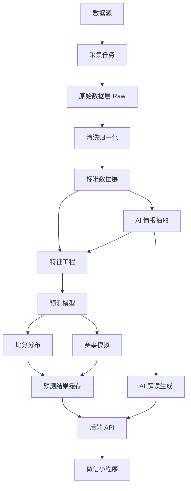
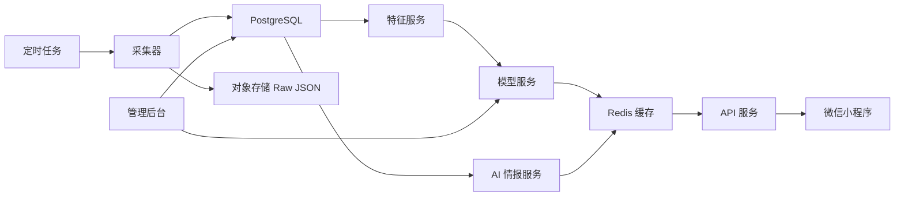

# 世界杯预测小程序 · 端到端技术方案

**更新时间：** 2026-06-13（v1.1，基于评审意见修订）  
**定位：** 低频数据更新 · 赛前预测 · AI 情报分析 · 可解释概率展示

> ⚠️ **时间窗口提示：** 世界杯已于 2026-06 开赛。若模型尚未就绪，建议先上线纯展示 + 静态解读版本，赛后再补完模型评估。

## 1. 项目目标

做一个世界杯预测小程序，核心不是实时比分，而是围绕每场比赛提供赛前判断：

- 胜平负概率（附预测置信度）
- 可能比分分布
- 小组出线、晋级、冠军概率
- 关键影响因素
- AI 生成的赛前解读
- 赛后预测复盘

**产品边界：**

- 不做秒级实时比分；数据按天、赛前、赛后低频更新。
- LLM 不直接预测胜负，只负责新闻理解、情报抽取、解释生成。
- 预测概率由结构化小模型（LightGBM / CatBoost）输出。
- 第一版聚焦微信小程序单端，不做多端适配。
- 当伤停数据缺失或阵容未更新时，预测结果标注**低置信度**，前端做相应提示。

## 2. 总体架构



核心链路：

```text
数据采集 -> 数据清洗 -> 新闻 AI 抽取 -> 特征生成 -> 模型预测
-> 泊松比分分布 -> 蒙特卡洛赛事模拟 -> AI 解读 -> 小程序展示
```

## 3. 数据源设计

### 3.1 赛程、比分、积分榜

用途：

- 展示比赛列表
- 生成小组积分
- 赛后更新模型评估
- 蒙特卡洛模拟赛事路径

来源：

| 来源 | 用途 | 获取方式 | 优先级 |
| --- | --- | --- | --- |
| Sportmonks / API-Football | 生产主数据源：赛程 / 比分 / 积分 | 商业授权 API | ★★★ 主 |
| 懂球帝 | 中文补充、交叉校验、原型阶段 | 内部 JSON / HTML | ★★☆ 补 |
| FIFA 官方 | 赛程权威校验 | 官网页面 / 人工 | ★☆☆ 校 |

> ⚠️ 懂球帝接口非公开文档 API，原型阶段可低频使用；生产阶段必须切换至授权数据源，懂球帝仅作中文补充和校验。

懂球帝已确认信息：

```text
世界杯 cid = 61
世界杯 season_id = 26123
```

> ⚠️ **接口稳定性风险：** 大赛期间懂球帝可能改接口结构或加鉴权。建议：采集层加异常监控（接口挂了立即告警）；数据入库后读库不读外部接口；尽早评估 API-Football 免费套餐作为备用。

可用接口形态：

```text
赛程：
https://pc.dongqiudi.com/sport-data/soccer/biz/data/schedule
  ?season_id=26123
  &app=dqd
  &version=853
  &platform=ios
  &language=zh-cn
  &round_all=1

积分榜：
https://pc.dongqiudi.com/sport-data/soccer/biz/data/standing
  ?season_id=26123
  &app=dqd
  &version=850
  &platform=ios
  &language=zh-cn
```

核心字段：

```text
match_id
competition_id
round_id
team_A_id
team_A_name
team_B_id
team_B_name
start_play
status
fs_A
fs_B
score_A
score_B
minute
```

### 3.2 球员和球队统计

用途：

- 球员近期状态
- 预计首发强度
- 进攻、防守、创造力、门将状态
- 球队身价和阵容深度

懂球帝球员榜接口：

```text
https://pc.dongqiudi.com/sport-data/soccer/biz/data/person_ranking
  ?season_id=26123
  &app=dqd
  &type=goals
  &language=zh-cn
```

`type` 可切换：

```text
goals
assists
shots
shots_on_target
key_passes
tackles
interceptions
saves
rating
yellow_cards
red_cards
passes
pass_accuracy
touches
clearances
aerials_won
ground_duels_won
```

球员榜核心字段：

```text
person_id
person_name
person_logo
team_id
team_name
team_logo
rank
count
goal
penalty_goal
row_1
row_2
```

球员详情页：

```text
https://pc.dongqiudi.com/player/{person_id}
```

可提取：

```text
中文名
英文名
头像
俱乐部
国籍
位置
年龄
生日
身高
体重
惯用脚
身价
近 20 场比赛
近 20 场进球
近 20 场助攻
近 20 场评分
近 20 场出场情况
```

球队榜建议补充：

```text
进球
失球
射门
射正
传球
传球成功率
抢断
拦截
解围
扑救
评分
身价
```

注意：

- 懂球帝接口不是公开文档 API，正式上线不建议作为唯一主数据源。
- 可作为中文补充源、交叉校验源、内部原型数据源。
- 商业化上线应优先接授权数据源。

### 3.3 阵容、伤停、预计首发

用途：

- 阵容稳定性
- 核心球员缺阵影响
- 预计首发总身价
- 预计首发近期状态

懂球帝阵容接口形态：

```text
https://pc.dongqiudi.com/sport-data/soccer/biz/dqd/bkb_match/lineup/{match_id}
  ?app=dqd
  &lang=zh-cn
```

核心字段：

```text
base
team_A
team_B
pre_lineup
injury
inactive_person
```

需要注意：

- 部分比赛首发数组可能为空。
- 阵容和伤停要结合新闻、官方公告、商业 API 补全。

### 3.4 历史比赛数据

用途：

- 训练胜平负模型
- 训练进球期望模型
- 计算 Elo
- 计算对不同强度球队战绩

建议来源：

| 数据 | 用途 |
| --- | --- |
| Fjelstul World Cup Database | 历届世界杯比赛、球员、进球、红黄牌 |
| Kaggle international football results | 国家队历史比赛 |
| StatsBomb Open Data | 部分高质量事件数据和 xG 数据 |
| FIFA Ranking | 国家队官方排名 |
| World Football Elo Ratings | 国家队 Elo 强度 |

训练数据不能只用世界杯，因为样本太少。建议训练集覆盖：

```text
世界杯
欧洲杯
美洲杯
非洲杯
亚洲杯
中北美金杯赛
世预赛
友谊赛
```

样本权重：

```text
世界杯：1.0
洲际杯：0.8
世预赛：0.7
友谊赛：0.4
```

### 3.5 新闻和情报

用途：

- 伤停
- 教练言论
- 战术变化
- 首发变动
- 队内状态
- 舆情和士气信号

来源：

```text
懂球帝资讯
FIFA 官方新闻
球队官方公告
The Guardian
NewsAPI
GDELT
其他体育媒体
```

AI 抽取结构：

```json
{
  "team": "法国",
  "player": "某主力中卫",
  "event_type": "injury",
  "impact_area": "defense",
  "impact_score": -0.07,
  "confidence": 0.84,
  "source": "dongqiudi",
  "published_at": "2026-06-13T10:00:00+08:00"
}
```

### 3.6 场馆和环境

用途：

- 主场/半主场优势
- 旅途距离
- 休息天数
- 气温、湿度、降雨、风速
- 海拔影响

来源：

```text
FIFA 场馆信息
Open-Meteo 天气 API
自建场馆表
球队驻地和比赛城市坐标
```

字段：

```text
venue_id
venue_name
city
country
capacity
latitude
longitude
altitude
surface
is_indoor
temperature
humidity
rain_probability
wind_speed
```

## 4. 数据更新策略

因为不做实时，可以低频更新：

```text
每天凌晨：
  更新赛程、积分榜、球员榜、球队榜、新闻列表

比赛前 24 小时：
  更新伤停、预计首发、新闻情报、天气

比赛前 3 小时：
  更新关键伤停、预计阵容、最终赛前预测

比赛后：
  更新赛果、积分榜、球员数据、预测评估
```

每次采集都生成快照：

```text
snapshot_id
snapshot_time
data_source
match_id
raw_payload
normalized_payload
```

这样可以复盘：

```text
当时用了哪些数据
当时模型版本是什么
当时预测概率是多少
赛后结果是否符合概率分布
```

## 5. 数据库设计

核心表：

```text
teams
players
matches
venues
coaches
raw_snapshots
team_stats_snapshots
player_stats_snapshots
news_items
ai_insights
model_features
model_versions
match_predictions
tournament_simulations
prediction_reviews
```

### 5.1 teams

```text
id
dqd_team_id
fifa_team_id
api_team_id
name_zh
name_en
country_code
logo_url
fifa_rank
elo_rating
market_value
created_at
updated_at
```

### 5.2 players

```text
id
dqd_person_id
api_player_id
name_zh
name_en
team_id
club
position
birth_date
age
height
weight
preferred_foot
nationality
market_value
photo_url
created_at
updated_at
```

### 5.3 matches

```text
id
dqd_match_id
competition_id
season_id
round_id
group_name
home_team_id
away_team_id
venue_id
start_time
status
home_score
away_score
home_penalty_score
away_penalty_score
created_at
updated_at
```

### 5.4 model_features

```text
id
match_id
snapshot_id
model_version_id
elo_diff
fifa_rank_diff
market_value_diff
recent_10_points_diff
recent_10_goal_diff
recent_10_goals_for_diff
recent_10_goals_against_diff
vs_top30_points_diff
player_form_diff
lineup_stability_diff
injury_impact_diff
coach_score_diff
rest_days_diff
travel_distance_diff
venue_advantage
weather_impact
created_at
```

### 5.5 match_predictions

```text
id
match_id
snapshot_id
model_version_id
home_win_prob
draw_prob
away_win_prob
home_expected_goals
away_expected_goals
scoreline_probs_json
key_factors_json
ai_explanation
prediction_confidence   -- low / medium / high，特征缺失时标 low，前端展示提示
created_at
```

## 6. 特征工程

每场比赛生成一行结构化特征。

### 6.1 基础实力特征

```text
elo_diff
fifa_rank_diff
market_value_diff
world_cup_experience_diff
major_tournament_score_diff
```

### 6.2 近期状态特征

```text
recent_5_points_diff
recent_10_points_diff
recent_10_goal_diff
recent_10_goals_for_diff
recent_10_goals_against_diff
recent_10_clean_sheet_rate_diff
recent_10_avg_opponent_elo_diff
```

### 6.3 对强队表现

按对手排名或 Elo 分桶：

```text
Top 10
Top 30
Top 60
60+
```

特征：

```text
vs_top10_points_per_match
vs_top30_points_per_match
vs_top30_goal_diff_per_match
vs_top60_points_per_match
```

### 6.4 球员状态聚合

不要把所有球员逐个塞进模型，先聚合成球队级特征：

```text
expected_starting_11_market_value
expected_starting_11_recent_goals
expected_starting_11_recent_assists
expected_starting_11_avg_rating
expected_starting_11_minutes
key_player_absence_score
goalkeeper_form_score
defense_form_score
midfield_creation_score
attack_form_score
bench_depth_score
```

### 6.5 阵容稳定性

```text
last_10_starting_lineup_overlap
main_formation_usage_rate
core_players_start_rate
avg_lineup_changes
coach_tenure_days
```

### 6.6 新闻 AI 特征

由 LLM 从新闻中抽取，经规则层映射后入模：

```text
injury_impact_score
suspension_impact_score
lineup_change_score
tactical_change_score
morale_score
coach_confidence_score
news_confidence_weight
```

> ⚠️ **量纲一致性问题：** `impact_score` 不建议让 LLM 直接输出数值（同样是"主力前锋伤停"，不同新闻 LLM 可能给出 -0.06 或 -0.15，引入噪声）。
>
> 推荐做法：让 LLM 只输出**分类**（`core` / `key` / `rotation`）和**方向**（`positive` / `negative` / `neutral`），数值由规则层映射：
>
> ```text
> core + negative  → -0.10
> key  + negative  → -0.06
> rotation + negative → -0.03
> ```
>
> 如保留 LLM 直接输出数值，则训练前必须做归一化，并在验证集上评估该特征贡献是否稳定。

### 6.7 环境特征

```text
rest_days_diff
travel_distance_diff
timezone_shift_diff
temperature_impact
humidity_impact
altitude_impact
host_advantage
```

## 7. 模型设计

不训练大语言模型，训练结构化小模型。

### 7.1 模型 1：胜平负概率模型

目标：

```text
输入：match_features
输出：home_win_prob, draw_prob, away_win_prob
```

候选模型：

```text
CatBoostClassifier
LightGBM multiclass classifier
XGBoost multiclass classifier
Logistic Regression baseline
```

第一版建议：

```text
Baseline：Elo + Logistic Regression
正式模型：CatBoost 或 LightGBM
```

原因：

- 对结构化特征友好。
- 能处理非线性关系。
- 样本量不大时比深度模型更稳。
- 可做特征重要性解释。

### 7.2 模型 2：进球期望模型

目标：

```text
输入：进攻、防守、节奏、伤停、场地等特征
输出：home_expected_goals, away_expected_goals
```

候选方案：

```text
Poisson Regression
Dixon-Coles Model
LightGBM Regressor
```

比分概率：

```text
P(home_goals = x) * P(away_goals = y)
```

输出示例：

```text
1-0: 11.2%
1-1: 10.7%
2-1: 9.6%
0-0: 8.4%
```

### 7.3 概率校准

必须做校准，否则概率会看起来很自信但不可靠。

评估指标：

```text
Log Loss
Brier Score
Calibration Curve
Expected Calibration Error
Top-1 Accuracy
```

校准方法：

```text
Platt Scaling
Isotonic Regression
Temperature Scaling
```

### 7.4 赛事模拟

小组和淘汰赛不用训练模型，拿单场概率做蒙特卡洛模拟。

流程：

```text
1. 对剩余每场比赛采样胜平负和比分
2. 更新小组积分、净胜球、进球数
3. 按 FIFA 规则决定排名和出线（见下方）
4. 生成淘汰赛对阵
5. 对淘汰赛继续采样
6. 重复 20,000 到 100,000 次
```

**FIFA 小组积分相同排名规则（必须按序实现）：**

```text
① 小组内相互对阵积分
② 小组内相互对阵净胜球
③ 小组内相互对阵进球数
④ 所有小组赛净胜球
⑤ 所有小组赛进球数
⑥ 公平竞赛积分（黄牌 -1 / 红牌 -3 / 黄红牌 -3 / 间接红牌 -3）
⑦ 抽签
```

> ⚠️ 这套规则比较复杂，实现有 bug 会导致出线概率失真。**强烈建议用已知历史小组结果（如 2022 年世界杯）做回测校验后再跑模拟。**

输出：

```text
小组出线概率
32 强概率
16 强概率
8 强概率
4 强概率
决赛概率
冠军概率
```

## 8. AI 设计

LLM 负责信息理解，不直接决定概率。

### 8.1 新闻抽取

输入：

```text
新闻标题
新闻正文
发布时间
来源
关联球队
关联球员
```

输出：

```json
{
  "event_type": "injury",
  "team": "阿根廷",
  "player": "某球员",
  "importance": "core_player",       // core / key / rotation
  "impact_area": "attack",
  "impact_direction": "negative",    // positive / negative / neutral（方向由 LLM 判断）
  "confidence": 0.81,
  "reason": "主力前锋缺席会降低预计首发进攻强度",
  "source_url": "https://..."        // 必填，不得编造
}
```

**AI 抽取约束：**

- 必须带 `source_url`，不得无中生有。
- 只允许基于输入文本抽取，不允许推断未提及的信息。
- `confidence < 0.6` 的情报不进入模型特征。
- 关键伤停（`importance = core_player`）需多源确认后才更新预测。

### 8.2 预测解释

输入：

```text
模型输出概率
Top 特征贡献
新闻情报
球队状态
球员状态
场地因素
```

输出：

```text
法国胜率更高，主要来自 Elo 和预计首发身价优势。
不过主力中卫伤停让防守评分下调，平局概率被抬高。
巴西近期进攻状态更好，因此最可能比分集中在 1-1、2-1、1-2。
```

### 8.3 数据冲突检查

LLM 和规则共同检查：

```text
球员已伤停但仍出现在预计首发
同一球员多个中文译名
同一球队多个来源 ID 不一致
新闻时间早于已更新的官方公告
异常比分或异常开球时间
```

## 9. 后端服务设计

推荐技术栈：

```text
API 服务：FastAPI / NestJS
模型服务：Python + CatBoost / LightGBM
数据库：PostgreSQL
缓存：Redis
任务调度：Celery / APScheduler
对象存储：原始快照 JSON
AI 服务：OpenAI API
```

服务拆分：

```text
collector-service
normalizer-service
feature-service
model-service
simulation-service
ai-insight-service
api-service
admin-service
```

第一版可以先做成一个后端仓库，内部按模块拆分，不必过早微服务化。

### 9.1 API 示例

```text
GET /api/matches/today
GET /api/matches/{match_id}
GET /api/matches/{match_id}/prediction
GET /api/teams/{team_id}
GET /api/players/{player_id}
GET /api/groups
GET /api/tournament/simulation/latest
GET /api/rankings/champion-probability
```

比赛预测返回：

```json
{
  "match_id": "54328038",
  "home_team": "墨西哥",
  "away_team": "南非",
  "home_win_prob": 0.56,
  "draw_prob": 0.25,
  "away_win_prob": 0.19,
  "prediction_confidence": "medium",
  "confidence_note": "阵容数据赛前 3 小时更新，伤停已确认",
  "expected_score": {
    "home": 1.62,
    "away": 0.88
  },
  "top_scorelines": [
    {"score": "1-0", "prob": 0.112},
    {"score": "1-1", "prob": 0.103},
    {"score": "2-1", "prob": 0.091}
  ],
  "key_factors": [
    "墨西哥近期进攻效率更高",
    "南非对 Top30 球队战绩偏弱",
    "墨西哥预计首发身价占优"
  ],
  "ai_explanation": "墨西哥胜率更高，但平局概率不低，主要因为双方节奏偏慢。"
}
```

## 10. 小程序设计

### 10.1 页面结构

```text
首页
  今日比赛
  重点比赛
  冠军概率 Top 10
  热门 AI 解读

比赛详情页
  胜平负概率
  比分概率
  关键因素
  AI 解读
  双方近期状态
  预计首发/伤停
  历史交锋

球队页
  基础信息
  小组排名
  近期状态
  对强队表现
  球员状态
  阵容稳定性
  主教练信息

球员页
  基础信息
  近期比赛
  进球助攻
  评分
  伤停状态

小组页
  积分榜
  剩余赛程
  出线概率

预测榜
  冠军概率
  四强概率
  黑马指数
```

### 10.2 小程序技术选型

候选：

```text
微信原生小程序
Taro
uni-app
```

建议：

```text
如果只做微信：微信原生小程序
如果未来要多端：Taro
如果团队更熟 Vue：uni-app
```

### 10.3 前端数据策略

小程序只读缓存结果，不直接抓外部数据。

```text
小程序 -> 后端 API -> Redis/PostgreSQL -> 预测结果
```

好处：

- 响应快。
- 不暴露数据源。
- 不受外部接口波动影响。
- 方便统一限流和缓存。

## 11. 部署架构



推荐环境：

```text
开发环境：
  本地 Docker Compose

测试环境：
  云服务器 + PostgreSQL + Redis

生产环境：
  腾讯云 / 阿里云
  PostgreSQL 托管版
  Redis 托管版
  定时任务服务
  对象存储
```

## 12. MVP 开发计划

### 阶段 1：数据闭环

目标：能拿数据、入库、展示。

任务：

```text
接入懂球帝赛程
接入懂球帝积分榜
接入懂球帝球员榜
建立 teams / players / matches 表
建立数据快照表
做后端基础 API
```

### 阶段 2：基础预测

目标：能输出可解释的基础概率。

任务：

```text
导入历史国家队比赛
计算 Elo
生成近期状态特征
训练 Logistic Regression / LightGBM baseline
实现 Poisson 比分模型
实现比赛详情预测接口
```

### 阶段 3：AI 情报

目标：让 AI 参与新闻理解和解释。

任务：

```text
采集新闻
LLM 抽取伤停和战术信号
写入 ai_insights
把 injury_impact 接入特征工程
生成 AI 预测解读
```

### 阶段 4：赛事模拟

目标：输出小组出线和冠军概率。

任务：

```text
实现小组规则
实现淘汰赛路径
实现蒙特卡洛模拟
生成 tournament_simulations
小程序展示出线概率
```

### 阶段 5：小程序完善

目标：形成完整用户体验。

任务：

```text
首页
比赛详情页
球队页
球员页
小组页
预测榜
分享卡片
```

## 13. 风险和处理

### 13.1 数据授权风险

风险：

```text
懂球帝接口不是公开文档 API。
直接商业化抓取和重分发存在合规风险。
```

处理：

```text
原型阶段可低频使用。
生产阶段接 Sportmonks / API-Football 等授权数据源。
懂球帝作为中文补充和校验。
```

### 13.2 数据质量风险

风险：

```text
球员 ID 映射错误
中文译名不统一
阵容数据缺失
伤停新闻冲突
```

处理：

```text
建立 team_aliases 和 player_aliases。
多源交叉校验。
关键比赛支持人工审核。
保存数据快照，便于复盘。
```

### 13.3 模型样本风险

风险：

```text
世界杯样本太少。
国家队比赛频率低。
友谊赛强度不稳定。
```

处理：

```text
训练覆盖全部国家队比赛。
按赛事类型加权。
使用 Elo 和市场强度作为稳定特征。
做概率校准。
```

### 13.4 AI 幻觉风险

风险：

```text
LLM 可能错误抽取新闻含义。
LLM 可能编造未出现的信息。
```

处理：

```text
要求 AI 输出必须带 source_url。
只允许基于输入文本抽取。
低置信度情报（< 0.6）不进入模型。
关键伤停需要多源确认。
```

### 13.5 时间窗口风险（新增）

风险：

```text
世界杯已于 2026-06 开赛，时间窗口极紧。
若历史数据未导入、模型未训练完，预测结果无法及时上线。
```

处理：

```text
立即评估当前进度，确认是否能在下一场重点比赛前完成 P0 功能。
若模型未就绪，先上线纯展示 + 静态解读版本（赛程 / 积分榜 / 懂球帝数据直出）。
模型部分在赛后复盘阶段补完，同时为下届积累完整训练数据和评估基线。
```

## 14. 推荐第一版范围

第一版不要做太大，按优先级排序：

| 优先级 | 功能 | 说明 |
| --- | --- | --- |
| P0 | 赛程 / 积分榜采集 + 数据入库 | 基础数据闭环，必须先完成 |
| P0 | 历史比赛导入 + Elo 计算 | 模型训练前置依赖 |
| P0 | LightGBM 胜平负模型 + Poisson 比分模型 | 核心预测能力 |
| P0 | 比赛详情页（小程序） | 对用户的最小可见价值 |
| P1 | AI 新闻抽取 + 预测解读 | 工程量大、稳定性要求高，P0 跑通后再加 |
| P1 | 小组出线概率（蒙特卡洛） | 依赖单场预测模型就绪 |
| P2 | 球队页 / 球员页 / 预测榜 | 锦上添花，P0 全部完成后再做 |

> 💡 **AI 新闻抽取降为 P1 的原因：** 它是工程量最大、稳定性最难保证的模块。时间紧时先跑通纯结构化预测 + 静态关键因素展示，AI 解读在第二阶段补充，不影响核心预测价值。

**第一版验收标准：**

```text
给任意一场世界杯比赛，能展示：
  胜平负概率（含置信度标注）
  可能比分 Top 10
  3 到 5 个关键因素
  AI 解读（P1 阶段加入）
  小组出线影响

比赛结束后，能记录：
  当时预测概率
  当时使用的 snapshot_id 和模型版本
  实际结果
  Log Loss / Brier Score
```

## 15. 最终推荐架构清单

| 层级 | 技术选型 | 备注 |
| --- | --- | --- |
| 前端 | 微信原生小程序 / Taro | 只做微信选原生；多端选 Taro |
| 后端 API | FastAPI (Python) | 轻量异步，自动 OpenAPI 文档 |
| 数据库 | PostgreSQL | 支持 JSON 字段存快照 |
| 缓存 | Redis | 预测结果缓存，响应 < 50ms |
| 采集任务 | APScheduler / Celery | 低频触发，赛前加密采集 |
| 模型 | LightGBM / CatBoost + Poisson / Dixon-Coles | 结构化特征，可解释 |
| AI | OpenAI API（新闻抽取 / 预测解释 / 冲突检查） | LLM 负责理解，不负责决策 |
| 主数据源 | Sportmonks / API-Football（授权） | 生产必须用授权源 |
| 补充数据源 | 懂球帝（原型 / 中文补充） | 非公开 API，不得作为唯一生产源 |
| 部署 | 腾讯云 / 阿里云（托管 PG + Redis + 对象存储） | 原始快照永久保留，支持赛后复盘 |

